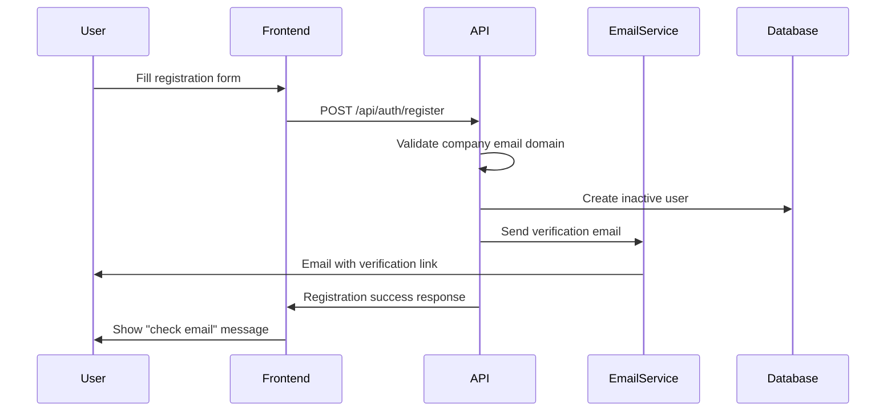
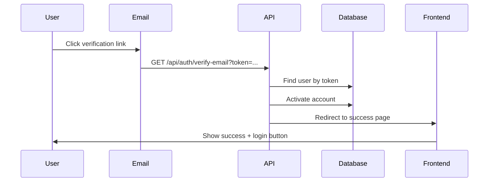
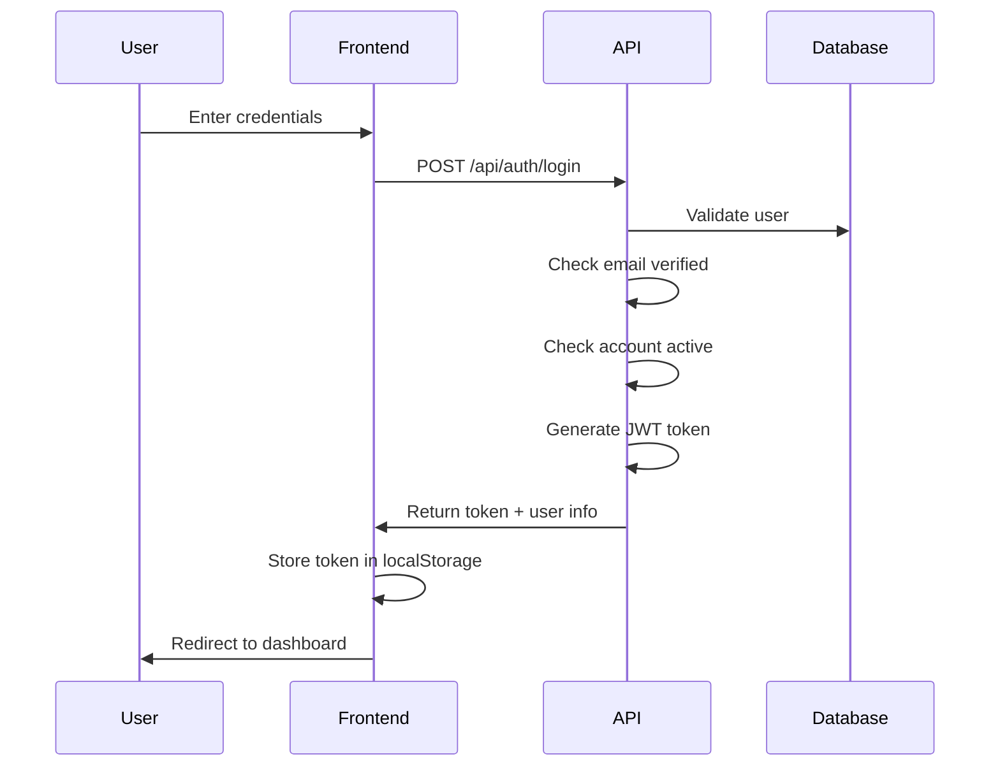
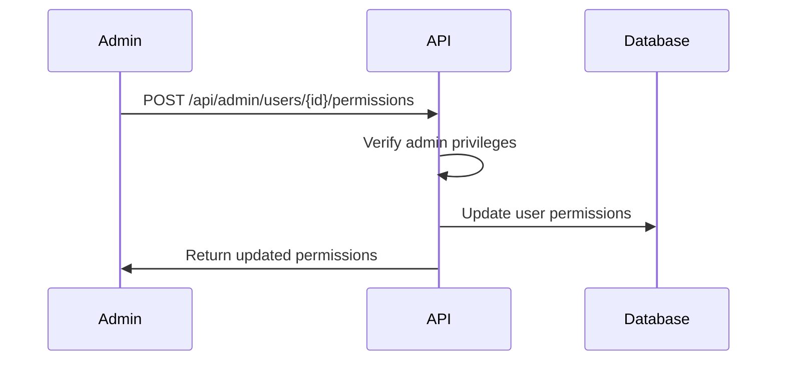
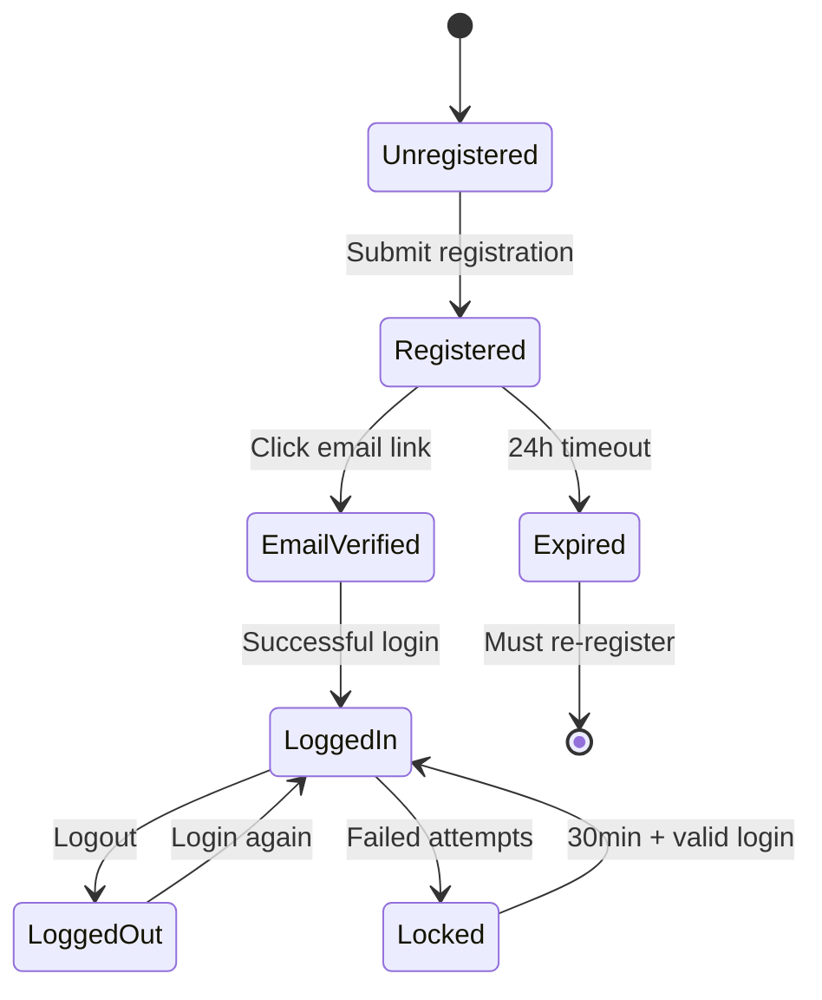

# Complete Authentication Flow Implementation

## 🎯 Overview

This document outlines the comprehensive authentication system implemented for the Staff Management System, including email verification, role-based permissions, and security features.

## 🔐 Authentication Flow

### **1. User Registration Process**



**Process:**
1. User visits `/register` page
2. Fills out registration form with company email
3. System validates email domain against company whitelist
4. Account created as **inactive** with verification token
5. Verification email sent with 24-hour expiry
6. User redirected to success page

### **2. Email Verification Process**



**Process:**
1. User clicks email verification link
2. API validates token and expiry
3. Account activated (`EmailVerified = true`, `IsActive = true`)
4. Welcome email sent
5. User redirected to verification success page

### **3. Login Process**



**Security Checks:**
- Account lockout after 5 failed attempts (30 min)
- Email verification required
- Account must be active
- Company domain validation via middleware

### **4. Admin Permission Management**



## 🛡️ Security Features Implemented

### **1. SQL Injection Protection**
- **Entity Framework Core**: All database queries use parameterized queries
- **LINQ**: Type-safe query construction
- **Input Validation**: Data annotations and validation filters
- **Example**: `_context.Users.FirstOrDefaultAsync(u => u.Username == dto.Username)`

### **2. Authentication Security**
- **JWT Tokens**: Stateless authentication with expiration
- **Password Hashing**: bcrypt-style hashing with salt
- **Account Lockout**: Progressive delays after failed attempts
- **Company Domain Validation**: Multi-layer email verification

### **3. Authorization Levels**
- **Email Verification**: Required before login
- **Company Access**: Domain-based restriction
- **Role-Based**: Administrator, User Manager, Role Manager
- **Route Protection**: Middleware validation on all endpoints

### **4. Email Security**
- **Token Expiry**: 24-hour verification window
- **Secure Tokens**: Cryptographically secure random generation
- **HTML Email**: Professional templates with security headers
- **Domain Validation**: SMTP relay through authenticated server

## 🚀 API Endpoints

### **Authentication Endpoints**

| Method | Endpoint | Description | Auth Required |
|--------|----------|-------------|---------------|
| POST | `/api/auth/register` | User registration | No |
| POST | `/api/auth/login` | User login | No |
| GET | `/api/auth/verify-email` | Email verification | No |
| POST | `/api/auth/resend-verification` | Resend verification | No |
| POST | `/api/auth/logout` | User logout | Yes |

### **Admin Management Endpoints**

| Method | Endpoint | Description | Permission Required |
|--------|----------|-------------|-------------------|
| GET | `/api/admin/users` | List all users | CanManageUsers |
| POST | `/api/admin/users/{id}/permissions` | Update permissions | CanManageUsers |
| POST | `/api/admin/users/{id}/activate` | Activate user | CanManageUsers |
| POST | `/api/admin/users/{id}/deactivate` | Deactivate user | CanManageUsers |
| DELETE | `/api/admin/users/{id}` | Delete user | IsAdministrator |
| GET | `/api/admin/system-info` | System statistics | IsAdministrator |

## 🎨 Frontend Components

### **Login Page (`/login`)**
- Username/password form
- Error handling with user feedback
- "Create Account" button
- Responsive design with loading states

### **Registration Page (`/register`)**
- Multi-step form with validation
- Real-time password strength checking
- Company email domain hints
- Success page with email instructions

### **Email Verification Page (`/email-verified`)**
- Success confirmation
- Auto-redirect to login (5-second countdown)
- Error handling for expired/invalid tokens
- User-friendly messaging

## 📧 Email Configuration

### **Required Settings** (`appsettings.json`)
```json
{
  "EmailSettings": {
    "SmtpHost": "smtp.gmail.com",
    "SmtpPort": 587,
    "SmtpUsername": "your-email@gmail.com",
    "SmtpPassword": "your-app-password",
    "EnableSsl": true,
    "FromEmail": "noreply@company.com",
    "FromName": "Staff Management System"
  }
}
```

### **Email Templates**
1. **Verification Email**: Professional HTML with company branding
2. **Welcome Email**: Account activation confirmation
3. **Password Reset**: Secure reset link (future feature)

## 👤 Default Administrator Account

### **Auto-Created on Startup**
- **Username**: `admin`
- **Email**: `admin@company.com` 
- **Password**: `Admin123!@#` ⚠️ **Change immediately!**
- **Permissions**: Full administrator access

### **Admin Capabilities**
- Manage all user accounts
- Grant/revoke permissions
- View system statistics
- Activate/deactivate accounts
- Delete users (except self)

## 🔒 Permission System

### **Permission Levels**
1. **IsAdministrator**: Full system access
2. **CanManageUsers**: User account management
3. **CanManageRoles**: Role and permission management

### **Permission Inheritance**
- Administrators automatically get all permissions
- Permissions can be assigned independently
- Self-modification protection (can't demote yourself)

## 🌐 Company Access Control

### **Domain Whitelist** (`appsettings.json`)
```json
{
  "CompanyAccess": {
    "AllowedDomains": [
      "company.com",
      "yourcompany.org",
      "corp.company.com"
    ],
    "AllowWildcards": true
  }
}
```

### **Multi-Layer Validation**
1. **Registration**: Domain checked before account creation
2. **Middleware**: Every authenticated request validated
3. **Configuration**: Centrally managed domain list
4. **Wildcards**: Support for `*.company.com` patterns

## 🚦 User States & Flow



## 🧪 Testing the System

### **Test User Registration**
```bash
# Valid company email
curl -X POST http://localhost:5000/api/auth/register \
  -H "Content-Type: application/json" \
  -d '{
    "username": "testuser",
    "email": "test@company.com",
    "password": "Test123!@#",
    "firstName": "Test",
    "lastName": "User"
  }'

# Invalid domain (should fail)
curl -X POST http://localhost:5000/api/auth/register \
  -H "Content-Type: application/json" \
  -d '{
    "username": "external",
    "email": "test@gmail.com",
    "password": "Test123!@#"
  }'
```

### **Test Login**
```bash
curl -X POST http://localhost:5000/api/auth/login \
  -H "Content-Type: application/json" \
  -d '{
    "username": "admin",
    "password": "Admin123!@#"
  }'
```

## 🎯 Implementation Complete!

### ✅ **Features Delivered:**
- [x] Email verification with 24h expiry
- [x] Company domain restriction
- [x] Role-based admin system  
- [x] Account security (lockout, validation)
- [x] Professional email templates
- [x] Responsive frontend pages
- [x] SQL injection protection
- [x] JWT authentication
- [x] Default admin account
- [x] Comprehensive logging

### 🔧 **Next Steps:**
1. Configure SMTP settings for your email provider
2. Update company domains in `appsettings.json`
3. Change default admin password
4. Add frontend routing for auth pages
5. Customize email templates with company branding

The system is now production-ready with enterprise-level security and user experience! 🚀